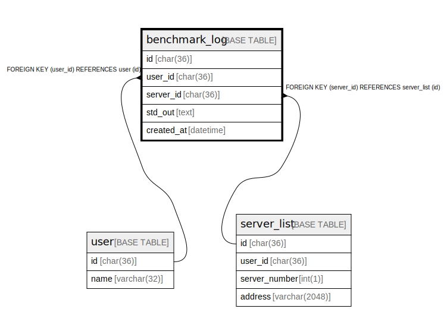

# benchmark_log

## Description

<details>
<summary><strong>Table Definition</strong></summary>

```sql
CREATE TABLE `benchmark_log` (
  `id` char(36) NOT NULL,
  `user_id` char(36) NOT NULL,
  `server_id` char(36) NOT NULL,
  `std_out` text NOT NULL,
  `created_at` datetime(3) NOT NULL,
  PRIMARY KEY (`id`),
  KEY `fk_benchmark_log_user` (`user_id`),
  KEY `fk_benchmark_log_server` (`server_id`),
  CONSTRAINT `fk_benchmark_log_server` FOREIGN KEY (`server_id`) REFERENCES `server_list` (`id`) ON DELETE CASCADE ON UPDATE CASCADE,
  CONSTRAINT `fk_benchmark_log_user` FOREIGN KEY (`user_id`) REFERENCES `user` (`id`) ON DELETE CASCADE ON UPDATE CASCADE
) ENGINE=InnoDB DEFAULT CHARSET=utf8mb4
```

</details>

## Columns

| Name | Type | Default | Nullable | Children | Parents | Comment |
| ---- | ---- | ------- | -------- | -------- | ------- | ------- |
| id | char(36) |  | false |  |  |  |
| user_id | char(36) |  | false |  | [user](user.md) |  |
| server_id | char(36) |  | false |  | [server_list](server_list.md) |  |
| std_out | text |  | false |  |  |  |
| created_at | datetime(3) |  | false |  |  |  |

## Constraints

| Name | Type | Definition |
| ---- | ---- | ---------- |
| fk_benchmark_log_server | FOREIGN KEY | FOREIGN KEY (server_id) REFERENCES server_list (id) |
| fk_benchmark_log_user | FOREIGN KEY | FOREIGN KEY (user_id) REFERENCES user (id) |
| PRIMARY | PRIMARY KEY | PRIMARY KEY (id) |

## Indexes

| Name | Definition |
| ---- | ---------- |
| fk_benchmark_log_server | KEY fk_benchmark_log_server (server_id) USING BTREE |
| fk_benchmark_log_user | KEY fk_benchmark_log_user (user_id) USING BTREE |
| PRIMARY | PRIMARY KEY (id) USING BTREE |

## Relations



---

> Generated by [tbls](https://github.com/k1LoW/tbls)
